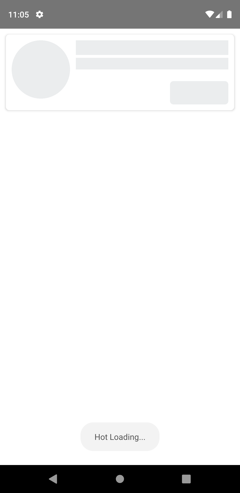
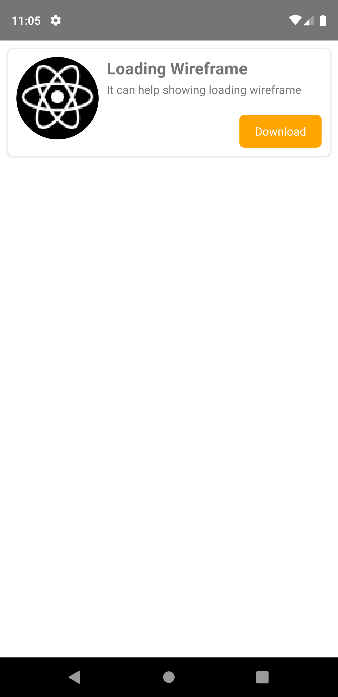

# **rn-loading-wireframe**

It can help showing loading wireframe effect for its wrapped components.

## Features

-   Support both Android and iOS
-   Possible to wrap more than one child component
-   Easy to use
-   Some customizations

## Demo




## Installation

-   Using **Npm**

```bash
npm install rn-loading-wireframe --save
```

-   Using **Yarn**

```bash
yarn add rn-loading-wireframe --dev
```

## Example

```jsx
import LoadingWireframe from 'rn-loading-wireframe';

<LoadingWireframe loading={true} color='#bdc3c7' fadeDuration={1000}>
	<Text
		style={{
			fontSize: 20,
			fontWeight: 'bold',
			width: 200,
			height: 25
		}}>
		Loading Wireframe
	</Text>
	<Text
		style={{
			marginTop: 5,
			width: 400,
			height: 20
		}}>
		It can help showing loading wireframe effect
	</Text>
	<TouchableHighlight
		style={{
			marginTop: 10,
			width: 100,
			height: 40,
			justifyContent: 'center',
			alignItems: 'center',
			backgroundColor: 'orange',
			borderRadius: 6
		}}>
		<Text style={{ color: '#fff' }}>Download</Text>
	</TouchableHighlight>
</LoadingWireframe>;
```
## Usage

### Available props

| Name               | Type    | Default   | Description                        |
| ------------------ | ------- | --------- | ---------------------------------- |
| loading            | bool    | false     | Should show the loading wireframe? |
| color              | string  | `#bdc3c7` | Color of the loading wireframe     |
| fadeDuration       | number  | 1000      | Duration of fading blink           |
| lowestFadeOpacity  | number  | 0.2       | The lowest opacity when fading out |

### Note

-   It cannot show unless you don't specify width and height in styles of its wrapped components.
